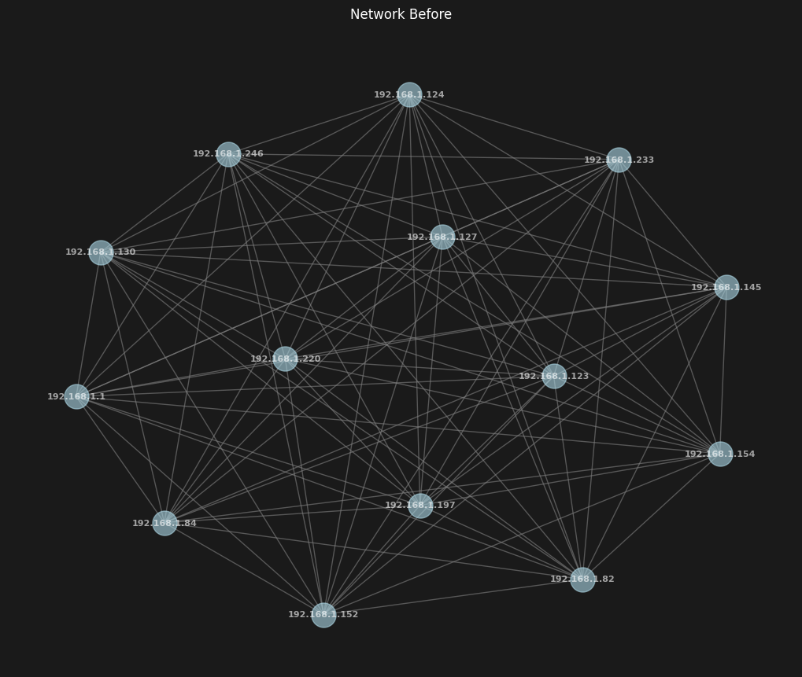

# Network Analysis Report - comparison_20241121133259

Generated on: 2024-11-21T13:33:00.510218

## Network Topology Changes

### Before and After Comparison

#### Network Before

#### Network After

## Structural Changes
| Metric | Value |
|--------|--------|
| New Nodes | 4 |
| Removed Nodes | 2 |
| New Edges | 54 |
| Removed Edges | 25 |
| Degree Distribution Change | 16 |

## Network Metrics Comparison
| Metric | Before | After | Change |
|--------|---------|--------|---------|
| Average Clustering | 1.000 | 1.000 | 0.000 |
| Network Density | 1.000 | 1.000 | 0.000 |
| Average Degree | 13.000 | 15.000 | +2.000 |
| Components | 1.000 | 1.000 | 0.000 |

## Critical Infrastructure Analysis

## K-Core Analysis

### Community Structure
- Modularity Score: 0.000
- Number of Bridge Nodes: 0
- Isolation Score: 1.000

### Critical Paths