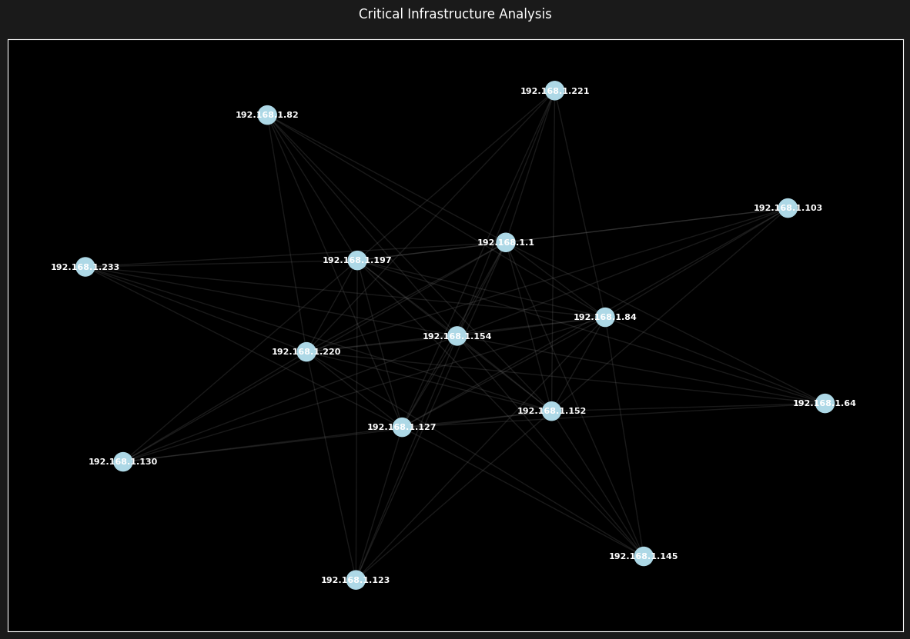
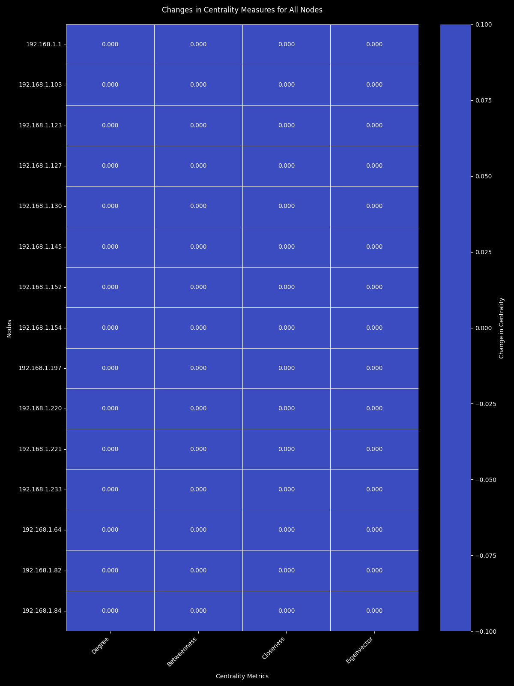

# Network Analysis Report

Generated on: 2024-11-25T14:11:02.880315

## Network Overview

## Structural Changes

| Change Type | Value |
|-------------|-------|
| New Nodes | 0 |
| Removed Nodes | 0 |
| New Edges | 0 |
| Removed Edges | 0 |
| Degree Distribution Change | 0 |

## Network Metrics Comparison

| Metric | Before | After | Change |
|--------|---------|--------|--------|
| Average Clustering | 0.856 | 0.856 | +0.000 |
| Network Density | 0.733 | 0.733 | +0.000 |
| Average Degree | 10.267 | 10.267 | +0.000 |
| Components | 1.000 | 1.000 | +0.000 |
| Average Path Length | 1.267 | 1.267 | +0.000 |
| Network Diameter | 2.000 | 2.000 | +0.000 |
| Fiedler Eigenvalue | 7.000 | 7.000 | +0.000 |
| Spectral Radius | 11.062 | 11.062 | +0.000 |
| Number of Communities | 1.000 | 1.000 | +0.000 |

## Critical Infrastructure Analysis

### Bridge Nodes

| Node | Impact |
|------|--------|

### Critical Paths

| Path | Length |
|------|--------|

## Network Segmentation

- Number of Segments: 1
- Modularity Score: 0.000
- Cross-Segment Connections: 0
- Isolation Score: 1.000

## Node Metrics Changes

## Recommendations

